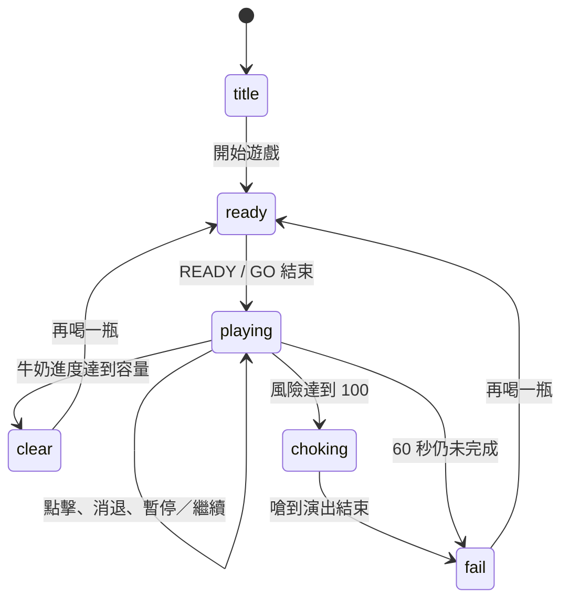
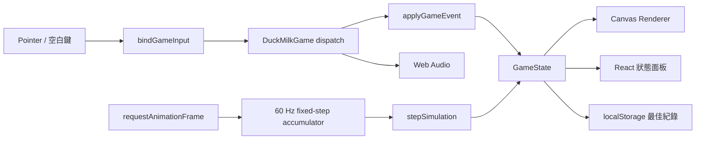

# 鴨鴨喝牛奶 🦆🥛

一款為手機直式、手機橫式與桌面瀏覽器設計的全螢幕連點節奏遊戲。

玩家必須快速連點讓鴨鴨喝完牛奶，同時觀察鴨鴨與左側嗆到特效，在「喝得夠快」和「不要嗆到」之間做取捨。遊戲刻意不顯示嗆到百分比與節奏等級，讓判斷、停手時機和風險控制成為真正的技巧。

[立即線上遊玩](https://duck-milk-rhythm.yoyo50582.chatgpt.site) · [GitHub Repository](https://github.com/apple595201908/duck-milk-rhythm)

[](LICENSE)


---

## 目錄

- [專案特色](#專案特色)
- [遊戲規則](#遊戲規則)
- [操作方式](#操作方式)
- [高手與新手的差異](#高手與新手的差異)
- [完整數值與平衡設計](#完整數值與平衡設計)
- [遊戲狀態流程](#遊戲狀態流程)
- [畫面與回饋設計](#畫面與回饋設計)
- [技術架構](#技術架構)
- [專案目錄](#專案目錄)
- [核心模組說明](#核心模組說明)
- [本機開發](#本機開發)
- [測試與品質檢查](#測試與品質檢查)
- [修改遊戲的方法](#修改遊戲的方法)
- [響應式與手機設計](#響應式與手機設計)
- [無障礙、輸入與瀏覽器行為](#無障礙輸入與瀏覽器行為)
- [資料保存與隱私](#資料保存與隱私)
- [建置與部署](#建置與部署)
- [常見問題](#常見問題)
- [目前限制與可延伸方向](#目前限制與可延伸方向)
- [授權](#授權)

---

## 專案特色

- **連點為核心**：每一次點擊都是一口牛奶，按住不會持續喝奶。
- **真正的風險博弈**：點得越快，牛奶喝得越快，但嗆到值也會更快累積。
- **危險區效率獎勵**：高手若能維持在接近紅色警戒的區域，每口可獲得額外喝奶量。
- **無數字式判斷**：不顯示嗆到百分比、危險進度條與節奏速度，玩家必須看鴨鴨表情、爆星大小、紅色暈影與畫面震動判斷。
- **清楚的牛奶視覺**：瓶身液面與瓶身百分比會隨實際剩餘量更新。
- **顯眼的正向計時器**：從 `00.00` 開始累計，而不是倒數。
- **完整嗆到演出**：超過風險上限時會先播放約 0.9 秒嗆到畫面，再顯示失敗視窗。
- **連貫喝奶動畫**：快速連點會持續刷新喝奶姿勢，不會在每次點擊間不自然地跳回待機。
- **全螢幕響應式介面**：畫面會填滿手機直式、手機橫式與桌面視窗，不使用固定正方形遊戲框。
- **零音訊素材依賴**：背景音樂、吞嚥聲與提示音全部由 Web Audio API 即時合成。
- **本機最佳紀錄**：最佳秒數與靜音設定保存在瀏覽器 `localStorage`。
- **可重現的固定步進模擬**：遊戲邏輯以 60 Hz 更新，並以自動化測試鎖定不同玩家節奏的時間範圍。

---

## 遊戲規則

### 目標

在 60 秒上限內喝完一整瓶牛奶，並盡可能縮短完成時間。

一般玩家的平衡目標約為 20 秒；熟悉警戒節奏的高手可以進入約 16 秒區間，較保守的新手則可能需要 30 秒以上。

### 勝利條件

牛奶飲用進度到達容量 `590` 時立即完成：

- 停止計時。
- 顯示本局成績。
- 若本局比舊紀錄快，更新瀏覽器中的最佳成績。
- 播放成功音效與成功姿勢。

若同一次點擊同時喝完牛奶並超過嗆到上限，程式會優先判定為完成，避免最後一口出現不合理的失敗。

### 失敗條件

有兩種失敗方式：

1. **嗆到**：風險值到達 `100`。鴨鴨會先進入嗆到演出，再顯示失敗畫面。
2. **超時**：正向計時到達 60 秒仍未喝完牛奶。

### 遊玩節奏

1. 按下「開始遊戲」。
2. 等待 `READY!` 與 `GO!`。
3. 快速連點遊戲畫面讓鴨鴨喝奶。
4. 左側黃色爆星變大時，代表風險正在升高。
5. 接近紅色爆星時喝奶效率最高，但再貪一口就可能嗆到。
6. 短暫停手讓風險消退，再重新連點。
7. 以最少的等待時間喝完牛奶。

---

## 操作方式

| 平台 | 喝牛奶 | 暫停／繼續 | 靜音 |
| --- | --- | --- | --- |
| 手機、平板 | 連續點擊遊戲畫面 | 點擊右上角暫停按鈕 | 點擊右上角喇叭按鈕 |
| 桌面瀏覽器 | 滑鼠左鍵連點遊戲畫面 | 點擊右上角暫停按鈕 | 點擊右上角喇叭按鈕 |
| 鍵盤 | 反覆按下空白鍵 | 點擊右上角暫停按鈕 | 點擊右上角喇叭按鈕 |

重要操作特性：

- 長按滑鼠、長按螢幕或壓住空白鍵都不會自動連續喝奶。
- 空白鍵的瀏覽器自動重複事件會被忽略，每次必須真的放開再按下。
- 同一時間只接受一個主要 Pointer，避免多指觸控造成不公平的多重點擊。
- 頁面失去焦點、切換到背景或裝置旋轉時，輸入狀態會取消；遊戲中離開頁面也會自動暫停。

---

## 高手與新手的差異

遊戲不是單純比較誰能最快亂點，而是比較玩家能否控制「速度、危險與休息時間」。

### 新手常見行為

- 在低風險區慢慢點，雖然安全，但每秒喝奶量較低。
- 看到黃色提示就休息太久，浪費大量時間。
- 完全不休息地狂點，數秒內直接嗆到。
- 無法從爆星、鴨鴨姿勢、紅色暈影和震動判斷何時該停手。

### 高手有效策略

- 迅速建立高速點擊等級。
- 把風險維持在黃色後段到紅色警戒附近，取得每口額外牛奶量。
- 只做必要的短暫停手，而不是讓風險完全退回安全區。
- 在爆星尺寸、紅色畫面與鴨鴨近嗆姿勢之間建立自己的停手節奏。

### 自動化模擬基準

以下數字來自固定步進測試使用的代表性點擊模型，用於驗證平衡，不保證每位真人玩家都會得到完全相同的時間：

| 玩家模型 | 點擊／休息方式 | 模擬結果 |
| --- | --- | --- |
| 無腦狂點 | 約每 7 frame 點一次，完全不休息 | 約 3.3 秒嗆到，僅喝約三分之一瓶 |
| 高手 | 約每 8 frame 點一次，風險高於 75% 才短暫休息 | 約 15.9 秒完成 |
| 一般玩家 | 約每 13 frame 點一次 | 約 19.9 秒完成 |
| 穩健玩家 | 約每 16 frame 點一次 | 約 26 秒完成 |
| 保守新手 | 約每 20 frame 點一次 | 約 35.7 秒完成 |

測試另外要求高手與保守新手的完賽時間至少相差 18 秒，防止後續修改讓所有成績再次收斂在狹窄區間。

---

## 完整數值與平衡設計

所有主要平衡參數集中在 [`src/game/config.ts`](src/game/config.ts)，方便修改與測試。

### 核心參數

| 參數 | 目前值 | 用途 |
| --- | ---: | --- |
| `fixedHz` | `60` | 每秒模擬更新次數 |
| `timeLimitMs` | `60,000` | 一局最長 60 秒 |
| `capacity` | `590` | 喝完整瓶所需總進度 |
| `progressBands` | `3` | 牛奶進度與鴨鴨圖像分段數 |
| `rateWindowFrames` | `40` | 每 40 frame 重新判定點擊速度 |
| `slowClickThreshold` | `2` | 視窗內最多 2 次點擊為低速 |
| `fastClickThreshold` | `4` | 視窗內 4 次以上點擊為高速 |
| `downshiftDelayFrames` | `20` | 速度等級下降前的緩衝 frame |
| `tapMilkBase` | `5.5` | 每口基礎喝奶量 |
| `tapMilkSpeedBonus` | `0.6` | 每一速度等級增加的喝奶量 |
| `riskMilkMaxBonus` | `0.8` | 接近高危險區時，每口最多額外喝奶量 |
| `riskMilkBonusStartRatio` | `0.35` | 35% 風險起開始獲得危險區效率獎勵 |
| `riskMilkBonusFullRatio` | `0.80` | 80% 風險取得完整效率獎勵 |
| `tapRiskBase` | `2.9` | 每次點擊的基礎嗆到增加量 |
| `tapRiskSpeedBonus` | `1.15` | 每一速度等級額外增加的嗆到量 |
| `riskGrowth` | `0.031` | 每次點擊後作用於累積風險的成長倍率 |
| `riskReliefIdleBase` | `0.10` | 每 frame 的基礎風險消退量 |
| `riskReliefIdleBonus` | `0.58` | 高風險時額外消退量 |
| `riskReliefCurvePower` | `1.05` | 風險消退曲線指數 |
| `riskLimit` | `100` | 嗆到門檻 |
| `warningRatio` | `0.35` | 35% 開始顯示黃色警告 |
| `criticalRatio` | `0.75` | 75% 進入紅色嚴重警告 |
| `tapDrinkAnimationFrames` | `14` | 每次點擊維持喝奶姿勢的 frame 數 |
| `animationCycleFrames` | `110` | 場景動畫循環長度 |

### 點擊速度等級

遊戲每 40 frame（約 0.667 秒）統計一次點擊數：

| 40 frame 內點擊數 | 目標速度等級 |
| ---: | ---: |
| 0–2 | `0` |
| 3 | `1` |
| 4 次以上 | `2` |

速度提升會立即逐級生效；速度下降則必須低於目前等級達 20 frame，避免短暫停手時動畫與喝奶效率過度跳動。

雖然速度等級仍存在於遊戲邏輯中，但畫面不會直接顯示它。玩家只能從喝奶動作的積極程度與實際成績感受差異。

### 每口喝奶量公式

先計算風險比例：

```text
riskRatio = clamp(risk / 100, 0, 1)
```

再將 35% 到 80% 的風險映射為 0 到 1 的效率獎勵：

```text
riskBonusProgress = clamp((riskRatio - 0.35) / (0.80 - 0.35), 0, 1)
```

最後得到每次點擊的喝奶量：

```text
tapMilk = 5.5 + speedLevel × 0.6 + riskBonusProgress × 0.8
```

因此：

- 低速且安全時，每口約 `5.5`。
- 高速但安全時，每口約 `6.7`。
- 高速且維持在 80% 以上風險時，每口最高約 `7.5`。

這個差異讓高手有縮短秒數的空間，但完整獎勵位於容易嗆到的區域，不能無代價取得。

### 每次點擊的嗆到累積公式

先依速度等級計算本次風險成本：

```text
tapRisk = 2.9 + speedLevel × 1.15
```

再把本次成本加入既有風險，套用 3.1% 成長倍率：

```text
nextRisk = (currentRisk + tapRisk) × 1.031
```

高速等級 `2` 的單次基礎成本為 `5.2`，而且累積風險也會被倍率放大，因此長時間不休息的狂點會很快失敗。

### 停手時的風險消退公式

遊戲每個固定 frame 都會執行風險消退：

```text
reliefPerFrame = 0.10 + 0.58 × riskRatio ^ 1.05
```

此外，每個 110 frame 動畫週期會有一次額外 `0.188` 的小幅消退。

這條非線性曲線具有兩個目的：

- 高風險時消退較快，讓高手可以用短暫停手貼著警戒區操作。
- 低風險時消退較慢，讓過度保守、每次都等到完全安全的玩法付出明顯時間成本。

### 視覺警戒門檻

| 風險比例 | 畫面回饋 | 遊戲意義 |
| --- | --- | --- |
| 0–34% | 一般場景 | 安全，但沒有危險區喝奶加成 |
| 35–74% | 左側黃色爆星、警告光暈 | 開始取得額外喝奶效率 |
| 75–99% | 紅色爆星、近嗆姿勢、紅色暈影、震動、「快嗆到了！」 | 最高效率區，也是最容易失敗的區域 |
| 100% 以上 | 嗆到演出 | 約 0.9 秒後進入失敗畫面 |

### 時間與演出

| 階段 | frame | 約略時間 |
| --- | ---: | ---: |
| `READY!` | `54` | 0.9 秒 |
| `GO!` | `42` | 0.7 秒 |
| 開場總準備時間 | `96` | 1.6 秒 |
| 嗆到反應 | `54` | 0.9 秒 |
| 每口喝奶動畫保持 | `14` | 0.233 秒 |

準備時間不會被算進正式成績；只有進入 `playing` 狀態後，`elapsedMs` 才會從 0 開始累加。

---

## 遊戲狀態流程



### 各狀態用途

| 狀態 | 說明 |
| --- | --- |
| `title` | 初始標題與開始按鈕 |
| `ready` | 播放 `READY!`、`GO!` 與開場提示音 |
| `playing` | 接受連點、累計時間、計算進度與風險 |
| `choking` | 凍結正式成績並播放嗆到反應，暫不顯示失敗視窗 |
| `clear` | 顯示完成成績與最佳紀錄 |
| `fail` | 顯示嗆到或超時結果 |

---

## 畫面與回饋設計

### 主畫面資訊層級

1. **中央鴨鴨**：最主要的操作與情緒焦點。
2. **頂部秒數**：以粗描邊與高對比顯示正向計時。
3. **右側牛奶瓶**：液面與百分比反映同一份實際遊戲進度。
4. **左側嗆到爆星**：隨危險程度放大並由黃色變為紅色。
5. **全畫面危險效果**：高風險時增加紅色暈影、放射線與震動。
6. **操作提示區**：只提供觀察方向，不直接暴露隱藏數值。

### 為什麼不顯示危險進度條

早期版本曾顯示牛奶與危險進度條，也顯示節奏速度。這會讓玩家只盯著數值控制，而不是看角色與場景，因此目前版本已移除：

- 底部「牛奶剩餘」進度條。
- 底部「危險／先休息」進度條。
- 左側「節奏速度」等級顯示。
- 畫面中的小型危險量條。

牛奶瓶仍保留液面與百分比，讓玩家知道關卡進度；嗆到程度則完全依賴插圖與動態特效判斷。

### 鴨鴨姿勢

目前使用的主要姿勢包含：

- `ready`：準備／待機。
- `drink`：一般喝奶。
- `fastDrink`：高速連點喝奶。
- `nearChoke`：接近嗆到。
- `spew`：嗆到噴奶。
- `success`：成功喝完。

姿勢繪製會保持來源圖像比例，避免角色被容器壓扁。快速點擊時，`drinkAnimationFrames` 會不斷重設為 14，使連續喝奶看起來像同一段連貫動作。

### 音效

音效由 [`src/game/audio.ts`](src/game/audio.ts) 使用 Web Audio API 即時合成：

- `ready`：開始提示。
- `go`：正式開始。
- `swallow`：每次點擊的吞嚥／咕嚕聲，可重疊播放。
- `clear`：完成旋律。
- `fail`：失敗下降音。
- `bgm`：3.2 秒循環旋律。

瀏覽器通常要求第一次使用者操作後才能啟動聲音，因此音訊系統會在開始遊戲或重試時呼叫 `unlock()`。

---

## 技術架構

### 技術棧

| 類別 | 技術 | 版本／用途 |
| --- | --- | --- |
| UI | React | `19.2.6` |
| 應用框架 | Next.js App Router | `16.2.6` |
| 建置與本機伺服器 | vinext + Vite | vinext `1.0.0-beta.3`、Vite `8.0.13` |
| 語言 | TypeScript | `5.9.3`，strict mode |
| 遊戲畫面 | Canvas 2D API | 場景、角色、瓶身、HUD、特效 |
| 音訊 | Web Audio API | 即時產生音效與背景音樂 |
| 樣式 | CSS + Tailwind PostCSS 載入 | 全螢幕與響應式版面 |
| 測試 | Vitest | `4.x`，Node 環境 |
| 程式碼品質 | ESLint | Next.js Core Web Vitals + TypeScript 規則 |
| 執行／部署目標 | Cloudflare Workers 相容輸出 | 透過 vinext、Cloudflare Vite plugin 與 OpenAI Sites plugin |

### 資料流



### 固定步進更新

畫面由 `requestAnimationFrame` 驅動，但遊戲邏輯不是直接依賴每次畫面的不固定間隔，而是使用 accumulator 累積時間，再以 `1,000 / 60` 毫秒固定更新：

- 不同螢幕更新率下可維持一致的風險消退與計時行為。
- 每一畫面最多追趕 5 個 simulation step，避免分頁短暫卡頓後一次執行過多邏輯。
- 分頁隱藏或暫停時清空 accumulator，避免回到頁面後時間瞬間暴增。

### React 與 Canvas 分工

- React 負責頁面結構、控制按鈕、最佳紀錄、提示文字與生命週期。
- `GameState` 保存在 `gameRef`，讓 60 Hz 邏輯不必依賴 React 每次重新渲染。
- Canvas 每個動畫 frame 直接讀取最新 `GameState` 繪圖。
- React snapshot 約每 80 ms 更新一次，或在場景切換時立即更新，降低不必要的 UI render。

---

## 專案目錄

```text
duck-milk-rhythm/
├─ .openai/
│  └─ hosting.json                 # Sites 專案綁定與資源設定
├─ app/
│  ├─ globals.css                  # 全站與遊戲響應式樣式
│  ├─ layout.tsx                   # 語系、SEO、Open Graph metadata
│  └─ page.tsx                     # 首頁入口
├─ public/
│  ├─ assets/
│  │  ├─ duck-atlas.png            # 備援角色／UI sprite atlas
│  │  ├─ duck-poses-v2.png         # 主要高品質鴨鴨姿勢圖
│  │  └─ game-background-v2.png    # 遊戲場景背景
│  ├─ favicon.svg                  # 網站圖示
│  └─ og.png                       # 社群分享預覽圖
├─ scripts/
│  └─ generate-placeholder-atlas.ps1 # 產生備援 sprite atlas 的 PowerShell 工具
├─ src/
│  ├─ assets/
│  │  ├─ duck-atlas.json           # atlas frame 座標與圖片資訊
│  │  └─ duck-poses-v2.json        # 主要姿勢 frame metadata
│  ├─ game/
│  │  ├─ audio.ts                  # Web Audio 合成與播放
│  │  ├─ config.ts                 # 所有遊戲平衡參數
│  │  ├─ input.ts                  # Pointer、鍵盤與瀏覽器事件
│  │  ├─ metrics.ts                # 時間、牛奶、風險計算函式
│  │  ├─ model.ts                  # GameState、GameEvent 與初始化
│  │  ├─ renderer.ts               # Canvas 2D 場景與角色繪製
│  │  ├─ scenes.ts                 # 場景文案與時間格式化
│  │  └─ simulation.ts             # 狀態轉移與固定步進遊戲邏輯
│  └─ ui/
│     └─ DuckMilkGame.tsx          # React 遊戲容器與主迴圈
├─ tests/
│  └─ simulation.test.ts           # 遊戲規則與平衡防回歸測試
├─ eslint.config.mjs               # ESLint 設定
├─ next.config.ts                  # Next.js 設定
├─ package.json                    # scripts、依賴與 Node 版本需求
├─ package-lock.json               # npm 鎖定版本
├─ tsconfig.json                   # TypeScript strict 設定
├─ vite.config.ts                  # vinext、Sites、Cloudflare 建置設定
└─ vitest.config.ts                # Vitest 測試設定
```

`dist/`、`.next/`、`.vinext/`、`.wrangler/`、`node_modules/` 與本機環境檔案不會提交到 Git。

---

## 核心模組說明

### `src/game/config.ts`

遊戲平衡的單一設定來源。喝奶容量、速度視窗、風險成長、消退曲線、警戒門檻、準備時間與嗆到反應時間都在這裡定義。

修改數值後應優先執行 `npm test`，確認高手、新手、一般節奏與狂點失敗行為仍符合預期。

### `src/game/model.ts`

定義完整 `GameState` 與 `GameEvent`：

- 場景與失敗原因。
- 牛奶進度與嗆到風險。
- 實際／目標速度等級。
- 計時、最佳成績與最終成績。
- 動畫、點擊統計、降速緩衝與反應 frame。

`createGameState()` 建立標題狀態，`createRoundState()` 建立進入 `ready` 的新一局，同時保留最佳成績。

### `src/game/metrics.ts`

集中處理可獨立測試的衍生數值：

- 顯示用經過時間。
- 每次點擊的實際喝奶量。
- 已喝與剩餘牛奶比例／百分比。
- 每 frame 的嗆到消退量。

所有輸出都會使用 `clamp` 控制範圍，避免瓶身百分比出現負值或超過 100%。

### `src/game/simulation.ts`

純狀態轉換核心，負責：

- 接受開始、重試、點擊、暫停等事件。
- 每次點擊增加牛奶與風險。
- 每個固定 frame 更新計時、消退風險與速度等級。
- 判定完成、嗆到與超時。
- 先播放嗆到反應，再進入失敗畫面。

這個模組不直接操作 DOM 或 Canvas，因此能在 Node 測試環境中快速模擬整局遊戲。

### `src/game/renderer.ts`

以 400 × 300 的邏輯舞台為基準，再依實際 Canvas 尺寸等比縮放並置中。背景會使用 cover 裁切填滿可用畫面，角色與 HUD 則維持一致的邏輯座標。

主要繪製項目：

- 場景背景與色彩 wash。
- 危險紅色暈影與放射線。
- 鴨鴨姿勢、速度 bob 與喝奶動作。
- 牛奶瓶液面與百分比。
- 左側黃色／紅色嗆到爆星。
- 頂部正向秒數。
- READY、GO、成功、失敗、暫停 overlay。

Canvas 會限制 device pixel ratio 最大為 2，在清晰度與手機效能之間取得平衡。

### `src/game/input.ts`

統一 Pointer Events 與鍵盤空白鍵輸入，並回傳 cleanup function，確保 React component 卸載時移除所有 listener。

### `src/ui/DuckMilkGame.tsx`

組合整個遊戲：

- 建立遊戲狀態與音訊實例。
- 綁定 Canvas 輸入。
- 執行 `requestAnimationFrame` 與固定步進 accumulator。
- 在狀態切換時觸發正確音效。
- 更新最佳紀錄與靜音偏好。
- 提供開始、重試、暫停、繼續與靜音 UI。

---

## 本機開發

### 環境需求

- Node.js `22.13.0` 以上。
- npm（建議使用 Node.js 隨附版本）。
- 支援 Canvas 2D、Pointer Events 與 Web Audio API 的現代瀏覽器。

### 取得專案

```bash
git clone https://github.com/apple595201908/duck-milk-rhythm.git
cd duck-milk-rhythm
```

### 安裝依賴

建議使用 lockfile 安裝完全一致的版本：

```bash
npm ci
```

### 啟動開發伺服器

```bash
npm run dev
```

預設網址：

```text
http://localhost:3000/
```

### 正式建置與啟動

```bash
npm run build
npm run start
```

`npm run start` 應在成功執行 `npm run build` 後使用。

### npm scripts

| 指令 | 實際執行 | 用途 |
| --- | --- | --- |
| `npm run dev` | `vinext dev` | 啟動本機開發伺服器與 HMR |
| `npm run build` | `vinext build` | 產生正式 Cloudflare Workers 相容輸出 |
| `npm run start` | `vinext start` | 啟動正式建置結果 |
| `npm run lint` | `eslint ...` | 檢查 React、Next.js 與 TypeScript 程式碼品質 |
| `npm run typecheck` | `tsc --noEmit` | 執行 TypeScript 靜態型別檢查 |
| `npm test` | `vitest run` | 執行所有自動化測試 |

---

## 測試與品質檢查

### 一次執行完整檢查

```bash
npm test
npm run typecheck
npm run lint
npm run build
```

目前 `tests/simulation.test.ts` 包含 20 項測試，涵蓋：

- 60 秒無輸入超時。
- 點擊只喝一口，release 不重複增加進度。
- 完成後凍結時間與最佳紀錄更新。
- 40-frame 視窗的速度等級判定。
- 高速的喝奶獎勵與額外風險。
- 高風險區的額外喝奶效率。
- 高風險時較快的自然消退。
- 快速連點時維持喝奶姿勢。
- 嗆到演出先於失敗視窗。
- 最後一口與嗆到同時發生時優先完成。
- 暫停後凍結計時。
- 無腦狂點在喝完一半前嗆到。
- 一般節奏約 20 秒完成。
- 保守節奏約 30–40 秒完成。
- 高手控制高風險約 15–17 秒完成。
- 高手與新手至少產生 18 秒差距。
- 秒數從 0 開始並在上限封頂。
- 牛奶百分比與同一份進度資料同步且限制在 0–100%。

平衡相關測試不是要把每個玩家鎖定在固定秒數，而是建立安全範圍。任何參數調整若破壞這些範圍，測試會立即提醒開發者重新評估。

---

## 修改遊戲的方法

### 調整遊戲難度

編輯 [`src/game/config.ts`](src/game/config.ts)。常見方向如下：

| 想要的效果 | 建議調整 |
| --- | --- |
| 整體喝得更快 | 降低 `capacity`，或提高 `tapMilkBase` |
| 拉大高手優勢 | 提高 `tapMilkSpeedBonus` 或 `riskMilkMaxBonus` |
| 降低高手優勢 | 降低速度／危險區喝奶 bonus |
| 讓狂點更容易嗆到 | 提高 `tapRiskBase`、`tapRiskSpeedBonus` 或 `riskGrowth` |
| 讓停手更快恢復 | 提高 `riskReliefIdleBase` 或 `riskReliefIdleBonus` |
| 懲罰過度保守等待 | 降低 `riskReliefIdleBase`，保留較高的高風險 bonus |
| 提早出現畫面警告 | 降低 `warningRatio` |
| 擴大紅色危險區 | 降低 `criticalRatio` |
| 延長嗆到演出 | 提高 `CHOKE_REACTION_FRAMES` |

每次修改至少應重新驗證以下四種模型：

1. 無腦高速狂點必須失敗。
2. 一般玩家仍應接近約 20 秒完成。
3. 高手必須能明顯快於一般玩家，但不能快到失去過程。
4. 保守新手必須可以安全完成，但付出較長時間。

### 更換角色或場景美術

主要檔案：

- `public/assets/duck-poses-v2.png`
- `src/assets/duck-poses-v2.json`
- `public/assets/game-background-v2.png`

更換 sprite sheet 時必須同步更新 JSON frame metadata，確保每個姿勢的 `x`、`y`、`w`、`h` 與新圖片一致。

`scripts/generate-placeholder-atlas.ps1` 可在 Windows 上重新產生簡化備援 atlas，但它不是目前主要高品質姿勢的來源。

### 修改場景繪製

編輯 [`src/game/renderer.ts`](src/game/renderer.ts)。邏輯舞台固定為 400 × 300，建議繼續使用這個座標系統，再由既有 `stageScale` 自動適應實際畫面。

### 修改介面文案

- React 面板與按鈕：`src/ui/DuckMilkGame.tsx`
- Canvas 場景 overlay：`src/game/renderer.ts`
- 螢幕閱讀器狀態文案：`src/game/scenes.ts`
- SEO 與社群分享文案：`app/layout.tsx`

### 修改音效

編輯 `src/game/audio.ts`：

- `makeTone()` 產生 READY、GO、成功與失敗音效。
- `makeGlug()` 產生每口吞嚥聲。
- `makeMelody()` 產生循環背景音樂。

目前不需管理 MP3、WAV 或外部音訊授權。

---

## 響應式與手機設計

### 全螢幕策略

- `.game-shell` 使用 `100vw × 100dvh`。
- `.game-card` 填滿整個可用區域，沒有固定比例外框與上下留白。
- 使用 `env(safe-area-inset-*)` 避開 iPhone 瀏海、動態島與 Home Indicator。
- `body` 禁止捲動，避免連點時頁面位移。
- Canvas 使用 `touch-action: none` 與 `user-select: none`，降低連點時的瀏覽器手勢干擾。

### 版面切換

| 條件 | 版面 |
| --- | --- |
| 桌面／寬螢幕 | 左側遊戲畫面、右側操作面板 |
| 寬度 680px 以下 | 上方標題、中間遊戲、下方操作面板 |
| 寬度 390px 以下 | 縮小標題、按鈕與提示字體 |
| 橫式且高度 620px 以下 | 放大遊戲區、使用窄版右側面板 |

### Canvas 縮放

Canvas 會讀取實際 CSS 尺寸，依 `devicePixelRatio` 建立實體像素；DPR 最高使用 2，避免高密度手機建立過大的 buffer。遊戲舞台等比縮放，而背景採 cover 裁切，因此直式與橫式都能滿版，同時不會把鴨鴨壓扁。

---

## 無障礙、輸入與瀏覽器行為

- HTML 根節點使用 `lang="zh-Hant"`。
- Canvas 具備 `role="button"`、`tabIndex="0"` 與操作說明 `aria-label`。
- 隱藏的 `aria-live="polite"` 區域會播報 READY、GO、喝奶、暫停、完成與失敗狀態。
- 開始、重試、靜音與暫停按鈕都使用原生 `<button>`。
- 鍵盤使用者可以用空白鍵喝奶。
- 焦點樣式使用高對比綠色 outline。
- 若使用者啟用 `prefers-reduced-motion: reduce`，CSS 動畫與 transition 會縮短到接近零。
- 遊戲畫面震動也會檢查 reduced-motion 偏好。
- 分頁失焦或進入背景時自動暫停，避免玩家在無法操作時繼續計時。

---

## 資料保存與隱私

本遊戲目前沒有帳號系統、後端資料庫、分析追蹤或廣告 SDK。

瀏覽器只保存兩項本機資料：

| localStorage key | 內容 |
| --- | --- |
| `duck-milk-best-ms` | 此瀏覽器的最佳完成毫秒數 |
| `duck-milk-muted` | 是否靜音 |

清除網站資料、使用無痕模式或更換瀏覽器後，最佳紀錄不會同步。最佳成績完全由前端保存，不具競賽防作弊能力。

---

## 建置與部署

### 建置流程

`vite.config.ts` 同時設定：

- `vinext()`：把 Next.js App Router 專案建置為 Vite／Workers 相容輸出。
- `sites()`：整合 OpenAI Sites 的開發與託管流程。
- `cloudflare()`：建立 Cloudflare Workers 相容的 RSC、SSR 與 client environments。
- Tailwind PostCSS plugin：處理全站 CSS import。

目前 `.openai/hosting.json` 沒有使用 D1 資料庫或 R2 bucket，因此遊戲是純前端、無後端持久化服務的部署。

### 正式部署前檢查

```bash
npm test
npm run typecheck
npm run lint
npm run build
```

只有在上述檢查全部通過後才應發布。

### 目前公開環境

- 正式網址：<https://duck-milk-rhythm.yoyo50582.chatgpt.site>
- 存取模式：公開，任何知道網址的人都能遊玩。
- SEO canonical base 與 Open Graph 圖片來源設定於 `app/layout.tsx`。

若建立自己的 Sites 專案，請使用該專案產生的 `.openai/hosting.json`，不要複製或手動猜測其他專案的識別資訊。

---

## 常見問題

### 為什麼秒數是正向計時，不是倒數？

遊戲的目標是挑戰最佳完成時間，因此從 `00.00` 往上計時更直覺。60 秒只是失敗上限，不是主要顯示方式。

### 為什麼看不到嗆到百分比？

這是刻意的遊戲設計。玩家必須從左側爆星、鴨鴨姿勢、紅色暈影與震動判斷風險，才能形成觀察與節奏技巧。

### 為什麼在黃色／紅色區喝得比較快？

從 35% 風險起，每口會逐漸獲得額外喝奶量，80% 時取得完整 bonus。這是用來拉開高手與新手秒數的核心機制。

### 為什麼我一直狂點很快就輸？

高速點擊除了提高每口風險，還會對既有累積風險套用成長倍率。正確玩法是在接近紅色警戒時短暫停手，而不是一路點到底。

### 為什麼按住不會喝奶？

遊戲設計以連點為主。每次 pointer down 或新的空白鍵按下只計算一口，release 不會增加進度，長按也不會自動觸發。

### 為什麼手機沒有聲音？

多數手機瀏覽器禁止頁面在使用者操作前自動啟動音訊。請先點擊「開始遊戲」，並確認右上角不是靜音狀態、系統音量已開啟。

### 為什麼切換分頁後遊戲暫停？

這是為了公平。玩家看不到頁面時無法操作，因此分頁隱藏、視窗失焦或裝置旋轉都會取消輸入，必要時暫停遊戲。

### 如何重設最佳紀錄？

在瀏覽器開發者工具清除該網站的 `localStorage`，或只刪除 `duck-milk-best-ms`。

### 修改數值後為什麼測試失敗？

平衡測試會鎖定代表性玩家的結果範圍。若修改是刻意的，應先重新模擬新手、一般、高手與狂點玩家，再合理更新測試區間，不能只為通過測試而放寬所有限制。

---

## 目前限制與可延伸方向

目前版本專注於單人、單局與本機最佳成績，尚未包含：

- 線上排行榜與帳號系統。
- 伺服器端防作弊或成績驗證。
- 多種難度、關卡或不同容量的牛奶瓶。
- 每日挑戰、成就、角色解鎖與造型系統。
- 觸覺震動回饋。
- 完整多語系切換。
- GitHub Actions 自動測試與部署。
- PWA 安裝與離線快取。

適合的下一步方向：

1. 加入每日固定 seed 挑戰，讓所有玩家使用相同參數競速。
2. 新增伺服器驗證排行榜，但保留本機快速開玩模式。
3. 提供練習模式，短暫顯示隱藏風險數值，幫助新手理解節奏。
4. 增加不同鴨鴨、牛奶口味與場景，但不改變核心判斷語言。
5. 使用 Playwright 增加手機直式、橫式與桌面端的端對端測試。
6. 建立 GitHub Actions，在每次 pull request 自動執行 test、typecheck、lint 與 build。

---

## 貢獻與開發原則

若要提交修改，建議遵循以下流程：

1. 從 `main` 建立功能分支。
2. 保持 simulation 邏輯與 renderer／React 顯示分離。
3. 新增或修改規則時同步補上 Vitest 測試。
4. 數值調整必須同時驗證狂點、高手、一般玩家與新手模型。
5. 不要重新加入直接顯示的危險百分比或節奏速度，除非產品方向明確改變。
6. 保持手機直式與橫式滿版，不新增固定正方形畫框。
7. 提交前執行完整品質檢查。

建議 commit message 使用清楚的命令式描述，例如：

```text
Tune high-risk recovery curve
Add mobile landscape layout test
Improve near-choke animation
```

---

## 版本沿革摘要

| 階段 | 主要變更 |
| --- | --- |
| 初版 | 建立鴨鴨喝牛奶節奏遊戲、Canvas renderer 與基本狀態機 |
| 美術升級 | 加入高品質場景、鴨鴨姿勢、危險特效與社群預覽圖 |
| 響應式改版 | 改為手機直式、橫式與桌面全螢幕布局 |
| 操作改版 | 從按住操作改為純連點，加入連續喝奶動畫 |
| 平衡改版 | 一般玩家約 20 秒完成，提高嗆到與停手之間的博弈 |
| 技巧差距改版 | 加入高風險喝奶 bonus、調整消退曲線，移除數值進度條與節奏顯示 |

---

## 授權

本專案採用 [MIT License](LICENSE) 授權，著作權所有 © 2026 `apple595201908`。

你可以自由使用、複製、修改、合併、出版、散布、再授權及銷售本軟體，但必須在軟體的所有副本或重要部分中保留原始著作權聲明與 MIT 授權聲明。本軟體依「現狀」提供，不附帶任何明示或默示擔保；完整法律條文請參閱 [`LICENSE`](LICENSE)。

---

## 專案連結

- 線上遊戲：<https://duck-milk-rhythm.yoyo50582.chatgpt.site>
- GitHub：<https://github.com/apple595201908/duck-milk-rhythm>

祝你喝得快、看得準，別讓鴨鴨嗆到！🦆🥛
